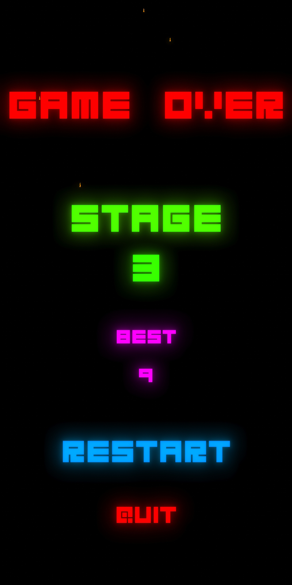

# Gates-Android-

(Screenshots of game)

# About
This is my first experience with mobile development and wanted to try it out. This game was created in unity ad a 2D game targeted at 1920 x 1080 displays but did my best to account of other aspect ratios as well. Creating this game was a huge learning process and a lot of fun I got to play with C# while writing all the scripts required to get desired behaviors as well as practice object oriented programming once again. I really wanted to create a mobile app because it seemed like a great opportunity to learn something new as well as get something I made into other peoples hands. 

# What I learned
C# |
Unity |
Object oriented programming practices |
Thinking about the device the app will be used on and accounting for differences in mediums |

# Note
All of the code and assets were done by me EXCEPT the tail attached to the player I want to give credit to "HowlinnWolf" for that super cool algorithm.
https://answers.unity.com/questions/1343711/trail-effect-for-non-moving-object.html
(Link to where I got the code)

                                    

